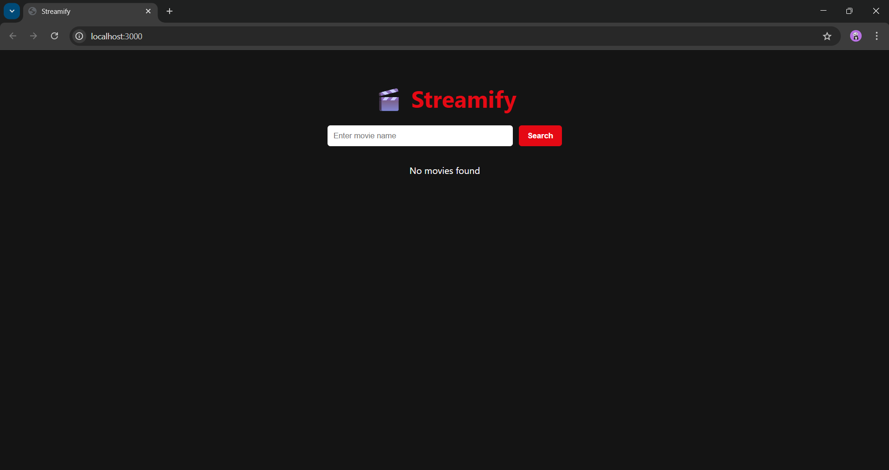
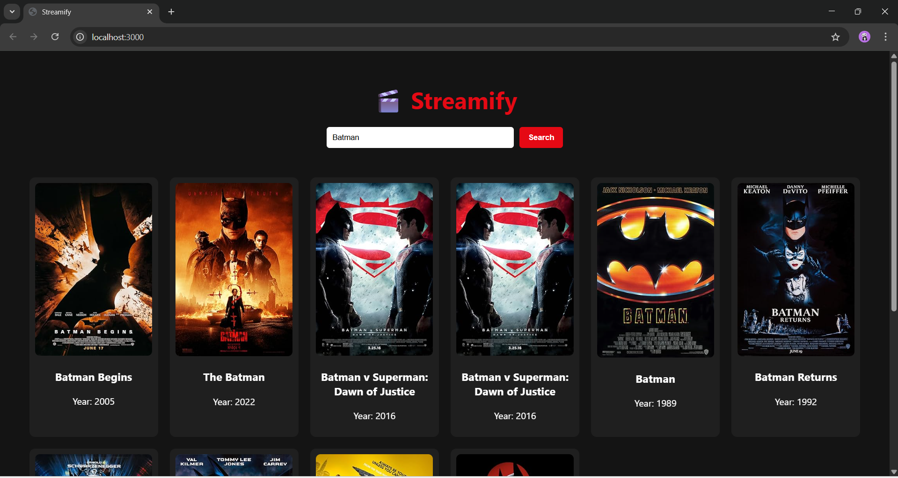
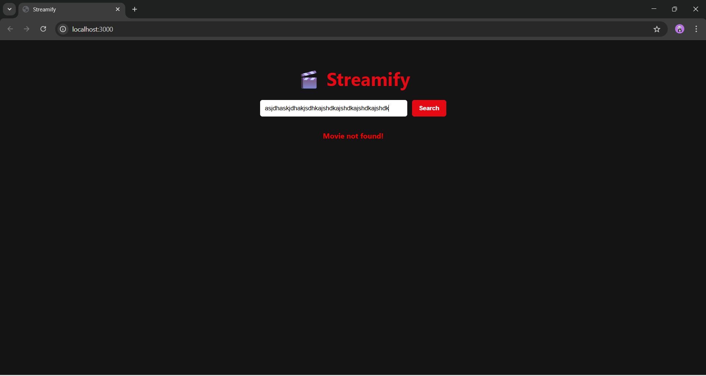

# 🎬 Streamify - React Movie Search Application

Streamify is a modern and responsive movie search web application built using ReactJS. It allows users to search for movies, filter results, and view detailed movie information using the OMDB API.

---

## 🚀 Features

- Search movies by title  
- Filter movies by release year    
- API integration using Axios  
- Loading indicator  
- Error handling  
- Responsive UI design  
- Component-based architecture using React  

---

## 🛠️ Tech Stack

- ReactJS  
- JavaScript (ES6)  
- Axios  
- CSS  

---

## 📁 Project Structure

Streamify/
│
├── public/
│
├── src/
│   ├── components/
│   ├── services/
│   ├── styles/
│   ├── App.js
│   ├── index.js
│
├── package.json
├── package-lock.json
├── .gitignore
└── README.md

---

## ⚙️ Installation and Setup

1. Clone the repository

git clone https://github.com/your-username/streamify.git
cd streamify

2. Install dependencies

npm install

3. Add OMDB API key

Go to:
https://www.omdbapi.com/apikey.aspx

Then open:

src/services/MovieService.js

Replace:

const API_KEY = "YOUR_OMDB_API_KEY";

with your actual API key

4. Run the application

npm start

App will run at:
http://localhost:3000

---

## 📸 Screenshots
### Home Page

### Search Results

### MOVIE NOT FOUND

---

## 👩‍💻 Author

Bhumika M D  

---

## 📄 License

This project is for educational purposes.